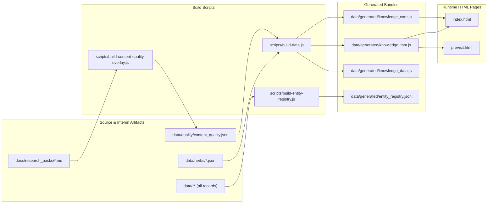

# AcuTing OS Unified Preflight / AI Change Safety Gate (Task 9D Round 4)

> **Execution Date**: 2026-08-26T06:31:31.091Z  
> **Status**: **PASS WITH WARNINGS**  
> **Mode**: FAST (Deterministic local only)  
> **Base Ref**: `origin/main`  
> **Type**: READ-ONLY Unified Repository Integrity & Mutation Gate (0 Canonical/Generated/Workflow Mutations)  

---

## 1. Executive Summary

| Gate Area | Status | Hard Failures | Regressions | Known Warnings | Improvements |
|---|---|---|---|---|---|
| **Overall Preflight Gate** | **PASS WITH WARNINGS** | **0** | **0** | **6** | **0** |
| **Hygiene & Encoding Gate** | **PASS** | 0 | 0 | 0 | 0 |
| **Git Mutation Scope Gate** | **PASS** | 0 | 0 | 1 (`curriculum/pharm/` untracked directory) | 0 |
| **Canonical Duplicate, Name, Alias & Orphan Gate (Task 9B)** | **PASS WITH WARNINGS** | 0 | 0 | 1 (5 TARGET_MISSING orphan references preserved) | 0 |
| **Generated Sync, Sandbox Rebuild & Dependency Graph Gate (Task 9C)** | **PASS WITH WARNINGS** | 0 | 0 | 1 (`entity_registry.json` differs) | 0 |
| **Validator Taxonomy & CI Coverage Gate (Task 9C)** | **PASS WITH WARNINGS** | 0 | 0 | 1 (12 orphan blocking validators preserved) | 0 |
| **Source & Provenance Transport Gate (Task 9A)** | **PASS WITH WARNINGS** | 0 | 0 | 2 (6 missing local paths; 95 dead HTTP links baseline) | 0 |

---

## 2. Preflight Architecture & Generalized Graph Model

```mermaid
flowchart TD
    A["AI / Agent Modification"] --> B["scripts/antigravity-preflight.js"]
    B --> CStartup Negative Controls
(13 In-Memory & Executable Fixtures)
    C -- "13/13 PASS" --> D["Fast / Deterministic Mode
(Default: No Network, Read-Only)"]
    D --> E["1. Git Mutation Scope vs origin/main
(Committed, Staged & Working Tree)"]
    D --> F["2. Hygiene Gate
(UTF-8, C0 Controls, Strict JSON Syntax)"]
    D --> G["3. Canonical Gate (Task 9B Engine)
(Exact Dups, Whitespace/Case Collisions, Name/Alias Collisions, 5 Orphan Refs)"]
    D --> H["4. Generated & Rebuild Gate (Task 9C Engine)
(7+1 Sync Domains, Rebuild Sandbox & Generalized Runtime Graph)"]
    D --> I["5. Validator & CI Gate (Task 9C Engine)
(Taxonomy, Blocking/Informational, False-Green Detection)"]
    D --> J["6. Source Gate (Task 9A Engine)
(Exact Multi-Pattern Tokenizer, 6241 Local Refs, 1260 URLs)"]
    D --> K["7. Identity-Aware Debt Ratchet
(Identity Comparison vs baseline.json)"]
    K --> LHard Failures == 0 &&
Regressions == 0?
    L -- "YES" --> M["RESULT: PASS / PASS WITH WARNINGS
(exit 0, Safe for Human Review)"]
    L -- "NO" --> N["RESULT: FAIL
(exit 1, Blocks Review)"]
    B -. "--deep" .-> O["Deep Mode (+ Real HTTP Transport Audit)"]
    O -.-> D
```

### Supported Modes:
1. **Fast / Deterministic Mode (`node scripts/antigravity-preflight.js`)**:
   - Deterministic local checks only (zero network calls, execution time ~8s, default 100% read-only).
   - Designed to run after every AI modification batch.
2. **Deep Mode (`node scripts/antigravity-preflight.js --deep`)**:
   - Executes real HTTP transport audit (`OK_200`, `REDIRECT_TO_200`, `DEAD_4XX`, `SERVER_5XX`, `TIMEOUT`, `OTHER_HTTP_STATUS`, `NETWORK_ERROR`).
3. **JSON Mode (`node scripts/antigravity-preflight.js --json`)**:
   - Outputs machine-readable report to stdout.
4. **Tracked Report Mode (`node scripts/antigravity-preflight.js --write-report`)**:
   - Explicitly writes `data/audits/antigravity_preflight_run.json`.
5. **Identity-Aware Baseline Ratchet Management (`node scripts/antigravity-preflight.js --update-baseline --reason "<reason>"`)**:
   - Manually updates `data/audits/antigravity_preflight_baseline.json` when debt is legitimately resolved. Fail-closed on malformed JSON.

---

## 3. Generalized Runtime / Build Dependency Graph



### Generic Classification Results:
- **`DIRECT_RUNTIME_LOADED`**: `knowledge_core.js`, `knowledge_mm.js`, `knowledge_rx.js`, `knowledge_dx.js`, `knowledge_pat.js`, `knowledge_ref.js`, `app_data.js`, `cloudtcm_map.js`, `points_361.js`, `data/tung/point_index.js`, `data/auricular/gb93_index.js`, `data/auricular/gb93_worklist.js`.
- **`TRANSITIVELY_BUNDLED_AND_LOADED`**: `data/quality/content_quality.json` (Read by `scripts/build-data.js` and bundled into `data/generated/knowledge_core.js`, which is loaded at runtime).
- **`GENERATED_BUT_UNUSED`**: `data/generated/entity_registry.json`, `data/generated/knowledge_data.js`.
- **`SITE_EXPECTS_MISSING_FILE`**: 0 files missing (0 hard failures).

---

## 4. Identity-Aware Debt Ratchet & Baseline Comparison

| Debt Category | Tracked Baseline Identities | Current Measured Identities | Ratchet Status |
|---|---|---|---|
| **Orphan Blocking Validators** | 12 script paths | 12 script paths | `KNOWN_DEBT_PASS` (0 regressions, 0 additions) |
| **Rebuild Differs Artifacts** | `data/generated/entity_registry.json` (1) | `data/generated/entity_registry.json` (1) | `KNOWN_DEBT_PASS` (0 regressions, 0 additions) |
| **Orphan Target-Missing References** | 5 formula_family edge identities | 5 formula_family edge identities | `KNOWN_DEBT_PASS` (0 regressions, 0 additions) |
| **Unique Missing Local Paths** | 6 unique paths | 6 unique paths | `KNOWN_DEBT_PASS` (0 regressions, 0 additions) |
| **Dead HTTP Links (Deep Mode)** | 95 dead URLs | 95 dead URLs baseline (`HTTP_NOT_RUN_IN_FAST_MODE`) | `KNOWN_DEBT_PASS` (Historical baseline warning) |

---

## 5. Negative Controls & Regression Test Proof (13/13 PASS)

1. `duplicate canonical ID` fixture $
ightarrow$ invokes `auditCanonicalIntegrity` on temp directory $
ightarrow$ asserts `hardFailures` contains duplicate ID $
ightarrow$ **PASS**.
2. `alias collision` fixture $
ightarrow$ invokes `auditAliasCollisions` on colliding records $
ightarrow$ asserts alias collisions caught $
ightarrow$ **PASS**.
3. `working-tree uncommitted mutation` fixture $
ightarrow$ initializes temporary git repo, modifies a file without commit, runs `analyzeGitMutationScope` $
ightarrow$ asserts `totalChangedFiles > 0` $
ightarrow$ **PASS**.
4. `generated duplicate ID` fixture $
ightarrow$ invokes `compareIdSets(['herb.a'], ['herb.a', 'herb.a'])` $
ightarrow$ asserts `GENERATED_DUPLICATE_ID` $
ightarrow$ **PASS**.
5. `generated missing ID` fixture $
ightarrow$ invokes `compareIdSets(['herb.a', 'herb.b'], ['herb.a'])` $
ightarrow$ asserts `GENERATED_MISSING_CANONICAL_ID` $
ightarrow$ **PASS**.
6. `generated extra ID` fixture $
ightarrow$ invokes `compareIdSets(['herb.a'], ['herb.a', 'herb.extra'])` $
ightarrow$ asserts `GENERATED_EXTRA_ID` $
ightarrow$ **PASS**.
7. `generic runtime dependency graph & synthetic transitive bundling` fixture $
ightarrow$ asserts synthetic `data/fixture.json` is `TRANSITIVELY_BUNDLED_AND_LOADED` without hardcoding production names $
ightarrow$ **PASS**.
8. `blocking CI validator exits 0 on defect` fixture $
ightarrow$ invokes `analyzeControlFlow('console.error("bad"); process.exit(0);')` $
ightarrow$ asserts `POSSIBLE_FALSE_GREEN` $
ightarrow$ **PASS**.
9. `informational report exits 0` fixture $
ightarrow$ invokes `classifyValidatorType('report-coverage.js', 'process.exit(0);')` $
ightarrow$ asserts `REPORT` $
ightarrow$ **PASS**.
10. `malformed baseline JSON fail-closed` fixture $
ightarrow$ invokes `loadPreflightBaseline` and `updatePreflightBaseline` on malformed file $
ightarrow$ asserts both throw and fail closed $
ightarrow$ **PASS**.
11. `replacement char / illegal C0 control char` fixture $
ightarrow$ invokes `checkStringOrBufferHygiene` $
ightarrow$ asserts `defects.length > 0` $
ightarrow$ **PASS**.
12. `identity-aware ratchet (new identity regression)` fixture $
ightarrow$ invokes `evaluateIdentityCategory` $
ightarrow$ asserts `passed === false` and `newIdentities.length === 1` $
ightarrow$ **PASS**.
13. `identity-aware ratchet (identity improvement)` fixture $
ightarrow$ invokes `evaluateIdentityCategory` $
ightarrow$ asserts `removedIdentities.length === 1` $
ightarrow$ **PASS**.

---

## 6. Invariant & Safety Proof

- **Canonical Data**: Byte-for-byte unchanged vs starting main (`0 bytes diff`).
- **Generated Production Artifacts (`data/generated/*`)**: Byte-for-byte unchanged vs starting main (`0 bytes diff`).
- **CI Workflows (`.github/workflows/*`)**: Byte-for-byte unchanged vs starting main (`0 bytes diff`).
- **Output Hygiene**: 0 illegal control characters, 0 replacement characters.
- **Preflight Result**: **PASS WITH WARNINGS** (0 hard failures, 0 regressions). Safe for independent human / clinical / semantic review.
